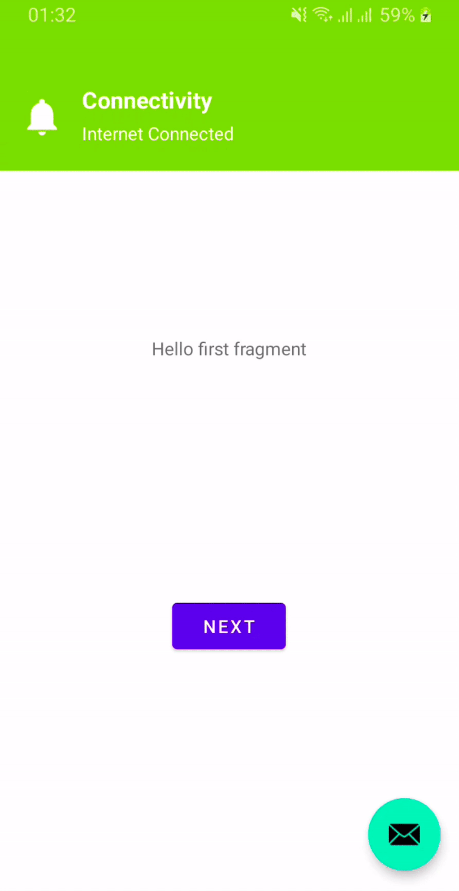

# android-connectivity

Android Connectivity State on Android 10 and Above

[](https://jitpack.io/#prongbang/android-connectivity)

## Preview



## Setup

- `build.gradle`

```groovy
buildscript {
    repositories {
        maven { url 'https://jitpack.io' }
    }
}
```

- `settings.gradle`

```groovy
dependencyResolutionManagement {
    repositories {
        maven { url 'https://jitpack.io' }
    }
}
```

- `app/build.gradle`

```groovy
implementation 'com.github.prongbang:android-connectivity:1.0.1'
```

## How to use

```kotlin
class MainActivity : AppCompatActivity(), ConnectivityStateListener {
    
    private val provider: ConnectivityProvider by lazy {
        ConnectivityProvider.create(this, lifecycle, this) 
    }

    override fun onCreate(savedInstanceState: Bundle?) {
        // Network state synchronously
        val hasInternet = connectivityProvider.getNetworkState().hasInternet()
        networkAlert(hasInternet)
    }

    // Network state via callback
    override fun onNetworkStateChange(state: NetworkState) {
        val hasInternet = state.hasInternet()
        networkAlert(hasInternet)
    }
    
}
```
